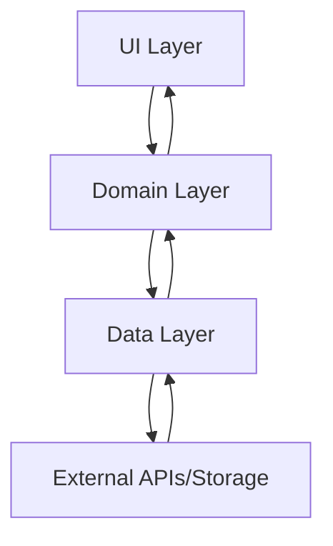

# 📱 Nova Arquitetura Flutter - Guia Completo

## 🎯 Visão Geral

Esta documentação apresenta a **nova arquitetura recomendada para Flutter**, baseada em princípios de **Clean Architecture** e boas práticas modernas de desenvolvimento. O projeto serve como exemplo prático de implementação.

## 🏗️ Estrutura da Arquitetura

A arquitetura é dividida em **3 camadas principais**:

```
lib/
├── 📋 domain/          # Regras de negócio e entidades
├── 💾 data/            # Acesso a dados e implementações
├── 🎨 ui/              # Interface do usuário
└── ⚙️ config/          # Configurações e dependências
```

### 🔗 Navegação da Documentação

- **[📋 Camada Domain](./domain.md)** - Entidades, DTOs e Validadores
- **[💾 Camada Data](./data.md)** - Repositories, Services e Storage
- **[🎨 Camada UI](./ui.md)** - Pages, ViewModels e Widgets
- **[⚙️ Configuração](./config.md)** - Injeção de Dependências
- **[🛠️ Padrões e Práticas](./patterns.md)** - Result, Freezed, Commands
- **[📖 Guia Prático](./practical-guide.md)** - Como implementar novos features

---

## 🎯 Princípios Fundamentais

### 1. **Separação de Responsabilidades**

Cada camada tem uma responsabilidade específica e bem definida.

### 2. **Inversão de Dependência**

As camadas superiores não dependem de implementações concretas das camadas inferiores.

### 3. **Testabilidade**

Todas as camadas podem ser testadas independentemente.

### 4. **Single Source of Truth (SSoT)**

O estado da aplicação é gerenciado de forma centralizada.

---

## 🔄 Fluxo de Dados



1. **UI** solicita dados através de ViewModels
2. **ViewModels** usam casos de uso (Commands) do Domain
3. **Domain** define contratos (Repositories) para Data
4. **Data** implementa os contratos e acessa APIs/Storage
5. **Dados retornam** seguindo o caminho inverso

---

## 📚 Tecnologias e Bibliotecas Utilizadas

- **[Freezed](https://pub.dev/packages/freezed)** - Classes imutáveis e union types
- **[Result Dart](https://pub.dev/packages/result_dart)** - Tratamento de erros funcionais
- **[Routefly](https://pub.dev/packages/routefly)** - Roteamento automático
- **[Injectable](https://pub.dev/packages/injectable)** - Injeção de dependências

---

## 🚀 Por que esta Arquitetura?

### ✅ Vantagens

- **Escalabilidade**: Fácil de adicionar novos features
- **Manutenibilidade**: Código organizado e fácil de entender
- **Testabilidade**: Cada camada pode ser testada isoladamente
- **Reutilização**: Lógica de negócio independente da UI
- **Flexibilidade**: Fácil troca de implementações

### 🎯 Ideal para

- Aplicações de médio/grande porte
- Equipes com múltiplos desenvolvedores
- Projetos de longo prazo
- Aplicações que requerem alta qualidade de código

---

## 🗂️ Estrutura do Projeto Exemplo

```
lib/
├── domain/
│   ├── entities/           # User (Freezed)
│   ├── dtos/              # Credentials
│   └── validators/        # CredentialsValidator
├── data/
│   ├── repositories/      # AuthRepository implementações
│   ├── services/          # HTTP Client, Storage
│   └── exceptions/        # Tratamento de erros
├── ui/
│   ├── auth/             # Login/Logout pages
│   ├── home/             # Home page
│   └── splash/           # Splash screen
├── config/
│   └── dependencies.dart # Configuração DI
├── main.dart             # Entry point
└── main_viewmodel.dart   # ViewModel principal
```

---

## 🎓 Para Iniciantes

Se você é iniciante, recomendo seguir esta ordem de estudo:

1. **[📋 Domain Layer](./domain.md)** - Comece entendendo as entidades
2. **[🛠️ Padrões](./patterns.md)** - Aprenda Result e Freezed
3. **[💾 Data Layer](./data.md)** - Entenda como buscar dados
4. **[🎨 UI Layer](./ui.md)** - Veja como conectar com a interface
5. **[📖 Guia Prático](./practical-guide.md)** - Implemente seu primeiro feature

---

## 💡 Próximos Passos

Após entender a arquitetura através desta documentação, você será capaz de:

- ✅ Criar aplicações Flutter escaláveis
- ✅ Implementar novos features seguindo as boas práticas
- ✅ Escrever código testável e maintível
- ✅ Trabalhar em equipe de forma mais eficiente

**[👉 Começar com a Camada Domain](./domain.md)**
