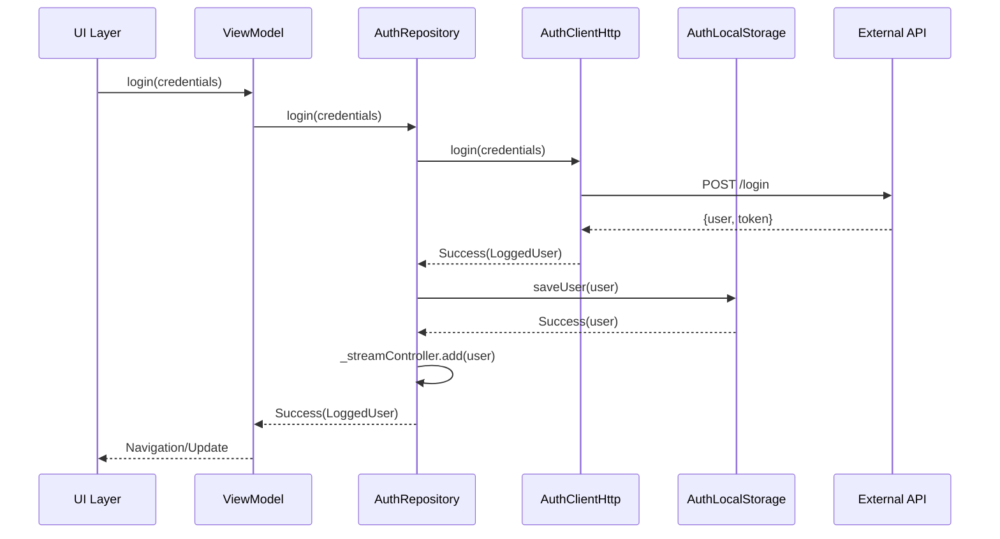

# 💾 Camada Data - Acesso a Dados

**[⬅️ Voltar: Domain](./domain.md)** | **[➡️ Próximo: UI Layer](./ui.md)**

---

## 🎯 O que é a Camada Data?

A **Camada Data** é responsável por **obter e persistir dados**. Ela implementa os contratos definidos na camada Domain e gerencia diferentes fontes de dados (APIs, storage local, cache).

> 💡 **Princípio**: Esta camada **implementa** os contratos do Domain, mas **não define** regras de negócio.

---

## 📁 Estrutura da Camada Data

```
data/
├── repositories/          # Implementações dos contratos
│   └── auth/
│       ├── auth_repository.dart         # Interface/Contrato
│       └── remote_auth_repository.dart  # Implementação
├── services/             # Serviços de acesso a dados
│   ├── client_http.dart              # Cliente HTTP genérico
│   ├── local_storage.dart            # Storage local genérico
│   └── auth/
│       ├── auth_client_http.dart     # Cliente HTTP auth
│       └── auth_local_storage.dart   # Storage auth
└── exceptions/           # Tratamento de erros
    └── exceptions.dart
```

---

## 🏗️ Repository Pattern - Contratos e Implementações

### 📄 AuthRepository - Interface (Contrato)

```dart
abstract interface class AuthRepository {
  AsyncResult<LoggedUser> login(Credentials credentials);
  AsyncResult<Unit> logout();
  AsyncResult<LoggedUser> getUser();
  Stream<User> userObserver();
  void dispose();
}
```

#### 🎯 Por que uma Interface?

1. **Inversão de Dependência**: UI não depende de implementação específica
2. **Testabilidade**: Fácil criar mocks para testes
3. **Flexibilidade**: Trocar implementações sem afetar outras camadas
4. **Contratos Claros**: Define exatamente o que a camada precisa

---

### 📄 RemoteAuthRepository - Implementação

```dart
class RemoteAuthRepository implements AuthRepository {
  RemoteAuthRepository(this._authLocalStorage, this._authClientHttp);

  final AuthLocalStorage _authLocalStorage;
  final AuthClientHttp _authClientHttp;
  final _streamController = StreamController<User>.broadcast();

  @override
  AsyncResult<LoggedUser> login(Credentials credentials) {
    return _authClientHttp
        .login(credentials)
        .flatMap(_authLocalStorage.saveUser)
        .onSuccess(_streamController.add);
  }

  @override
  AsyncResult<Unit> logout() => _authLocalStorage.removeUser().onSuccess(
    (_) => _streamController.add(const NotLoggedUser()),
  );

  @override
  AsyncResult<LoggedUser> getUser() => _authLocalStorage.getUser();

  @override
  Stream<User> userObserver() => _streamController.stream;
}
```

#### 🔍 Características da Implementação

##### 1. **Composição de Serviços**

- `AuthClientHttp`: Comunicação com API
- `AuthLocalStorage`: Persistência local
- `StreamController`: Observação de mudanças

##### 2. **Fluxo do Login**

```mermaid
graph LR
    A[login()] --> B[authClientHttp.login()]
    B --> C[authLocalStorage.saveUser()]
    C --> D[streamController.add()]
    D --> E[Success/Failure]
```

##### 3. **Single Source of Truth (SSoT)**

- ✅ **Estado centralizado** no Repository
- ✅ **Stream** para observar mudanças
- ✅ **Cache local** para offline

---

## 🌐 Services - Acesso a Dados

### 📄 AuthClientHttp - Comunicação com API

```dart
class AuthClientHttp {
  final ClientHttp _clientHttp;

  AuthClientHttp(this._clientHttp);

  AsyncResult<LoggedUser> login(Credentials credentials) async {
    // Implementação real com API
    final result = await _clientHttp.post('/login', {
      'email': credentials.email,
      'password': credentials.password,
    });

    return result.map((response) {
      return LoggedUser.fromJson(response.data);
    });
  }
}
```

#### 🎯 Responsabilidades

- ✅ **Comunicação HTTP** com APIs
- ✅ **Serialização** de dados
- ✅ **Tratamento de erros** de rede
- ✅ **Transformação** de Response para Entity

---

### 📄 AuthLocalStorage - Persistência Local

```dart
class AuthLocalStorage {
  final LocalStorage _localStorage;

  AuthLocalStorage(this._localStorage);

  AsyncResult<LoggedUser> getUser() => _localStorage
      .getData(_userKey)
      .map((json) => LoggedUser.fromJson(jsonDecode(json)));

  AsyncResult<LoggedUser> saveUser(LoggedUser user) => _localStorage
      .saveData(_userKey, jsonEncode(user.toJson()))
      .then((_) => Success(user));

  AsyncResult<Unit> removeUser() => _localStorage.removeData(_userKey);
}
```

#### 🎯 Responsabilidades

- ✅ **Persistência** de dados offline
- ✅ **Serialização JSON** para storage
- ✅ **Cache** de dados frequentes
- ✅ **Gerenciamento** de chaves de storage

---

## 🔄 Stream Pattern - Observação de Estado

### 📊 UserObserver - Reatividade

```dart
@override
Stream<User> userObserver() {
  return _streamController.stream;
}
```

#### 🎯 Por que Streams?

1. **Reatividade**: UI atualiza automaticamente
2. **Desacoplamento**: Múltiplos listeners podem observar
3. **Tempo Real**: Mudanças propagam instantaneamente
4. **Controle de Estado**: Centralização de mudanças

#### 💻 Exemplo de Uso

```dart
// No ViewModel
authRepository.userObserver().listen((user) {
  if (user is LoggedUser) {
    navigateToHome();
  } else {
    navigateToLogin();
  }
});
```

---

## ⚡ Result Pattern - Tratamento de Erros

### 🔍 AsyncResult<T>

Todos os métodos da camada Data retornam `AsyncResult<T>`:

```dart
// Sucesso
AsyncResult<LoggedUser> login(credentials) async {
  return Success(loggedUser);
}

// Erro
AsyncResult<LoggedUser> login(credentials) async {
  return Failure(LoginException('Invalid credentials'));
}
```

#### ✅ Vantagens do Result Pattern

1. **Explicit Error Handling**: Erros são parte da assinatura
2. **Composição**: Métodos como `flatMap`, `onSuccess`
3. **Type Safety**: Compilador força tratamento de erros
4. **Funcional**: Programação funcional para fluxos complexos

---

## 🏗️ Fluxo Completo de Autenticação



---

## 🎯 Princípios da Camada Data

### ✅ **Repository Pattern**

- Interface define contrato
- Implementação específica para cada fonte
- Fácil troca de implementações

### ✅ **Single Source of Truth**

- Estado centralizado no Repository
- Streams para propagação de mudanças
- Cache local para performance

### ✅ **Error Handling**

- Result pattern para tratamento explícito
- Exceções específicas por contexto
- Fallbacks para cenários offline

### ✅ **Separation of Concerns**

- Services focados em uma responsabilidade
- Repository orquestra diferentes services
- Abstração das complexidades de acesso a dados

---

## 📝 Boas Práticas

### ✅ **Faça**

- Use **interfaces** para definir contratos
- Implemente **cache local** para offline
- Use **Streams** para observação de estado
- Aplique **Result pattern** para erros
- Separe **HTTP** de **Storage** em services distintos

### ❌ **Evite**

- Lógica de negócio na camada data
- Acesso direto a storage da UI
- Mixing de diferentes fontes de dados sem abstração
- Exceptions não tratadas

---

## 🔍 Diferentes Implementações

### 📱 Implementações Possíveis

```dart
// Para desenvolvimento/testes
class MockAuthRepository implements AuthRepository { ... }

// Para ambiente local
class LocalAuthRepository implements AuthRepository { ... }

// Para produção
class RemoteAuthRepository implements AuthRepository { ... }

// Para ambiente híbrido
class HybridAuthRepository implements AuthRepository { ... }
```

#### 🎯 Vantagem da Abstração

- ✅ **Flexibilidade**: Trocar implementação conforme ambiente
- ✅ **Testabilidade**: Usar mocks em testes
- ✅ **Manutenibilidade**: Mudanças isoladas por implementação

---

## 💡 Próximos Passos

Agora que você entende como os dados são gerenciados, vamos ver como conectar tudo isso à interface do usuário:

**[➡️ Próximo: Camada UI](./ui.md)**

---

**[⬅️ Domain Layer](./domain.md)** | **[🏠 Início](./README.md)** | **[➡️ UI Layer](./ui.md)**
