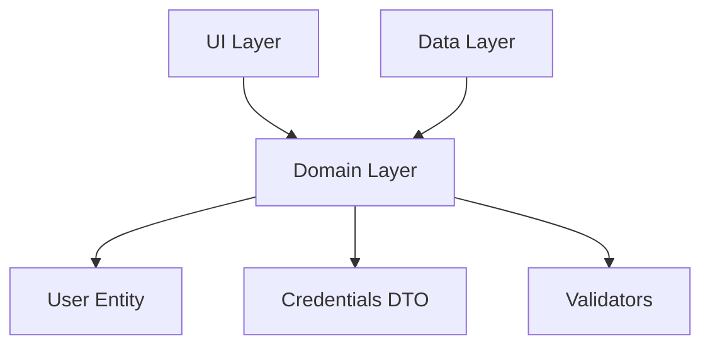

# 📋 Camada Domain - Regras de Negócio

**[⬅️ Voltar para início](./README.md)** | **[➡️ Próximo: Data Layer](./data.md)**

---

## 🎯 O que é a Camada Domain?

A **Camada Domain** é o **coração da aplicação**. Ela contém:

- **Entidades**: Modelos de dados fundamentais
- **DTOs**: Objetos para transferência de dados
- **Validadores**: Regras de validação de negócio
- **Contratos**: Interfaces para comunicação com outras camadas

> 💡 **Princípio**: Esta camada **não depende de nenhuma outra** - ela é completamente independente.

---

## 📁 Estrutura da Camada Domain

```
domain/
├── entities/           # Entidades do domínio
│   ├── user_entity.dart
│   ├── user_entity.freezed.dart  # Gerado automaticamente
│   └── user_entity.g.dart        # Gerado automaticamente
├── dtos/              # Data Transfer Objects
│   └── credentials.dart
└── validators/        # Validadores de negócio
    └── credentials_validator.dart
```

---

## 🏗️ Entities - Modelos Fundamentais

### 📄 UserEntity - Estado do Usuário

```dart
@freezed
sealed class User with _$User {
  const factory User.basic({
    required int id,
    required String name,
    required String email,
  }) = BasicUser;

  const factory User.notLogged() = NotLoggedUser;

  const factory User.logged({
    required int id,
    required String name,
    required String email,
    required String token,
    required String refreshtoken,
  }) = LoggedUser;

  factory User.fromJson(Map<String, Object?> json) => _$UserFromJson(json);
}
```

#### 🔍 Características do User Entity

1. **Sealed Class**: União de tipos que representa diferentes estados
2. **Freezed**: Gera código para imutabilidade e igualdade
3. **Union Types**: 3 estados possíveis do usuário

#### 📊 Estados do Usuário

| Estado             | Descrição                       | Quando usar              |
| ------------------ | ------------------------------- | ------------------------ |
| `User.basic()`     | Usuário básico sem autenticação | Dados simples de usuário |
| `User.notLogged()` | Usuário não logado              | Estado inicial, logout   |
| `User.logged()`    | Usuário autenticado             | Após login bem-sucedido  |

#### 💻 Exemplo de Uso

```dart
// Verificar se está logado
if (user is LoggedUser) {
  print('Token: ${user.token}');
}

// Pattern matching
user.when(
  basic: (id, name, email) => print('Usuário básico: $name'),
  notLogged: () => print('Não logado'),
  logged: (id, name, email, token, refresh) => print('Logado: $name'),
);
```

---

## 📦 DTOs - Data Transfer Objects

### 📄 Credentials - Dados de Login

```dart
class Credentials {
  String email;
  String password;

  Credentials({
    this.email = '',
    this.password = '',
  });

  void setEmail(String email) {
    this.email = email;
  }

  void setPassword(String password) {
    this.password = password;
  }
}
```

#### 🎯 Propósito dos DTOs

- **Transferir dados** entre camadas
- **Encapsular informações** relacionadas
- **Facilitar validação** em conjunto
- **Simplificar** parâmetros de métodos

#### 💻 Exemplo de Uso

```dart
final credentials = Credentials();
credentials.setEmail('user@example.com');
credentials.setPassword('MyPass123!');

// Usar para login
viewModel.loginCommand.execute(credentials);
```

---

## ✅ Validators - Regras de Negócio

### 📄 CredentialsValidator - Validação de Login

```dart
class CredentialsValidator extends LucidValidator<Credentials> {
  CredentialsValidator() {
    ruleFor((c) => c.email, key: 'email')
        .notEmpty()
        .validEmail();

    ruleFor((c) => c.password, key: 'password')
        .notEmpty()
        .minLength(6)
        .mustHaveLowercase()
        .mustHaveUppercase()
        .mustHaveNumber()
        .mustHaveSpecialCharacter();
  }
}
```

#### 🔍 Regras de Validação

##### 📧 Email

- ❌ **Não pode estar vazio**
- ✅ **Deve ter formato válido** (user@domain.com)

##### 🔐 Password

- ❌ **Não pode estar vazio**
- ✅ **Mínimo 6 caracteres**
- ✅ **Pelo menos 1 letra minúscula**
- ✅ **Pelo menos 1 letra maiúscula**
- ✅ **Pelo menos 1 número**
- ✅ **Pelo menos 1 caractere especial**

#### 💻 Exemplo de Uso

```dart
final validator = CredentialsValidator();
final credentials = Credentials(
  email: 'user@example.com',
  password: 'MyPass123!',
);

final result = validator.validate(credentials);

if (result.isValid) {
  // Prosseguir com login
} else {
  // Mostrar erros
  for (final error in result.errors) {
    print('${error.key}: ${error.message}');
  }
}
```

---

## 🛠️ Padrões Utilizados

### 1. **Freezed Pattern**

- ✅ **Imutabilidade**: Objetos não podem ser alterados
- ✅ **Igualdade**: Comparação baseada em valores
- ✅ **copyWith**: Criar novas instâncias com alterações
- ✅ **Union Types**: Diferentes variações da mesma entidade

### 2. **Validation Pattern**

- ✅ **Centralização**: Todas as regras em um local
- ✅ **Reutilização**: Mesmo validador em diferentes pontos
- ✅ **Flexibilidade**: Validação por campo específico
- ✅ **Internacionalização**: Suporte a múltiplos idiomas

---

## 🎯 Vantagens da Camada Domain

### ✅ **Independência**

Não depende de frameworks, APIs ou UI - apenas Dart puro

### ✅ **Testabilidade**

Fácil de testar unitariamente sem dependências externas

### ✅ **Reutilização**

Entidades podem ser usadas em diferentes contextos

### ✅ **Manutenibilidade**

Mudanças de regras ficam centralizadas

---

## 📝 Boas Práticas

### ✅ **Faça**

- Use **Freezed** para entidades complexas
- Centralize **validações** em validators
- Mantenha DTOs **simples** e focados
- Use **Union Types** para estados mutuamente exclusivos

### ❌ **Evite**

- Lógica de UI na camada domain
- Dependências de frameworks externos
- Entidades mutáveis sem controle
- Validações espalhadas pelo código

---

## 🔗 Conexão com Outras Camadas



- **UI Layer**: Usa entidades para exibir dados
- **Data Layer**: Implementa contratos definidos no domain
- **Validators**: Garantem integridade dos dados

---

## 💡 Próximos Passos

Agora que você entende a camada Domain, vamos ver como os dados são obtidos e persistidos:

**[➡️ Próximo: Camada Data](./data.md)**

---

**[⬅️ Voltar para início](./README.md)** | **[🛠️ Ver Padrões](./patterns.md)** | **[➡️ Data Layer](./data.md)**
