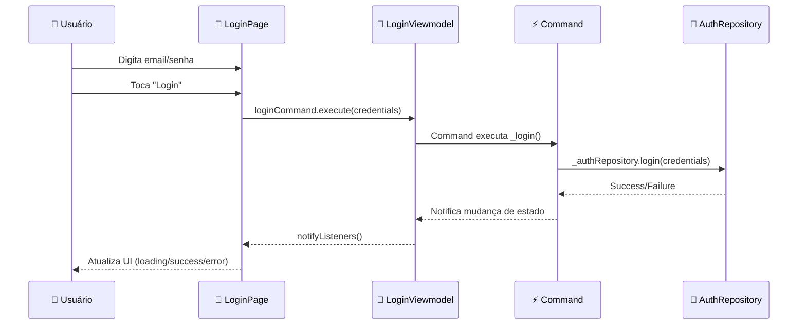

# 🎨 Camada UI - Interface do Usuário

**[⬅️ Voltar: Data](./data.md)** | **[➡️ Próximo: Config](./config.md)**

---

## 🎯 O que é a Camada UI?

A **Camada UI** é responsável pela **interface do usuário** e **interação**. Ela conecta o usuário com a lógica de negócio através de ViewModels, seguindo o padrão **MVVM (Model-View-ViewModel)**.

> 💡 **Princípio**: Esta camada **não contém lógica de negócio** - apenas apresentação e interação.

---

## 📁 Estrutura da Camada UI

```
ui/
├── auth/                    # Feature de autenticação
│   ├── login/
│   │   ├── login_page.dart           # Página de login
│   │   └── viewmodels/
│   │       └── login_viewmodel.dart  # ViewModel do login
│   └── logout/
│       ├── viewmodels/
│       │   └── logout_viewmodel.dart
│       └── widgets/
│           └── logout_button.dart    # Widget de logout
├── home/                    # Feature home
│   └── home_page.dart              # Página principal
└── splash/                  # Splash screen
    └── splash.dart
```

---

## 🏗️ MVVM Pattern - Separação de Responsabilidades

### 📱 View (Pages/Widgets)

- **Responsabilidade**: Apresentação visual
- **O que faz**: Constrói interface, captura eventos
- **O que NÃO faz**: Lógica de negócio, acesso a dados

### 🧠 ViewModel

- **Responsabilidade**: Lógica de apresentação e estado
- **O que faz**: Gerencia estado da tela, commands, validações
- **O que NÃO faz**: Acesso direto a dados, regras de negócio

### 📊 Model

- **Responsabilidade**: Dados e entidades
- **O que é**: Entities, DTOs do Domain layer

---

## 🔍 Análise: LoginPage

### 📄 LoginPage - A View

```dart
class LoginPage extends StatefulWidget {
  @override
  State<LoginPage> createState() => _LoginPageState();
}

class _LoginPageState extends State<LoginPage> {
  final viewModel = injector.get<LoginViewmodel>();
  final validator = CredentialsValidator();
  final credentials = Credentials();

  @override
  void initState() {
    super.initState();
    viewModel.loginCommand.addListener(_listenable);
  }

  void _listenable() {
    if (viewModel.loginCommand.value.isFailure) {
      final error = viewModel.loginCommand.value as FailureCommand;
      final snackBar = SnackBar(
        content: Text(error.error.toString()),
        backgroundColor: Colors.red,
      );
      ScaffoldMessenger.of(context).showSnackBar(snackBar);
    }
  }
}
```

#### 🎯 Características da View

1. **Injeção de Dependências**: `injector.get<LoginViewmodel>()`
2. **Observação de Estado**: `addListener` no command
3. **Feedback Visual**: Mostra erros via SnackBar
4. **Separação**: Validação e credentials locais à view

---

### 📄 LoginViewmodel - O ViewModel

```dart
class LoginViewmodel extends ChangeNotifier {
  final AuthRepository _authRepository;

  LoginViewmodel(this._authRepository);

  late final loginCommand = Command1(_login);

  AsyncResult<LoggedUser> _login(Credentials credentials) async {
    return _authRepository.login(credentials);
  }
}
```

#### 🎯 Características do ViewModel

1. **Command Pattern**: `Command1` para operações assíncronas
2. **Repository Dependency**: Injeta `AuthRepository`
3. **Simple Logic**: Apenas delega para repository
4. **ChangeNotifier**: Para observação de mudanças

---

## ⚡ Command Pattern - Operações Assíncronas

### 🔍 O que é o Command Pattern?

O **Command Pattern** encapsula operações assíncronas com estados:

- **Loading**: Operação em execução
- **Success**: Operação bem-sucedida
- **Failure**: Operação falhou

```dart
late final loginCommand = Command1(_login);

// Na UI
ListenableBuilder(
  listenable: viewModel.loginCommand,
  builder: (context, _) {
    return ElevatedButton(
      onPressed: viewModel.loginCommand.value.isRunning
          ? null
          : () => viewModel.loginCommand.execute(credentials),
      child: viewModel.loginCommand.value.isRunning
          ? CircularProgressIndicator()
          : Text('Login'),
    );
  },
)
```

#### ✅ Vantagens do Command Pattern

1. **Estado Automático**: Loading, success, failure gerenciados automaticamente
2. **UI Reativa**: Interface reage automaticamente aos estados
3. **Evita Bugs**: Previne dupla execução, estados inconsistentes
4. **Simplicidade**: Menos código boilerplate

---

## 🏠 MainViewmodel - Gerenciamento Global

### 📄 Observação de Estado Global

```dart
class MainViewmodel extends ChangeNotifier {
  final AuthRepository _authRepository;

  User _user = NotLoggedUser();
  User get user => _user;

  late final StreamSubscription _userSubscription;

  MainViewmodel(this._authRepository) {
    _userSubscription = _authRepository.userObserver().listen((user) {
      _user = user;
      notifyListeners();
    });
  }
}
```

#### 🎯 Responsabilidades do MainViewmodel

1. **Estado Global**: Gerencia estado do usuário da aplicação
2. **Observação**: Escuta mudanças do AuthRepository
3. **Navegação**: Determina fluxo de navegação baseado no estado
4. **Lifecycle**: Gerencia subscription corretamente

---

## 🔄 Fluxo de Interação Completo



---

## 🎨 Widgets Especializados

### 📄 LogoutButton - Widget Reutilizável

```dart
class LogoutButton extends StatelessWidget {
  @override
  Widget build(BuildContext context) {
    final viewModel = injector.get<LogoutViewmodel>();

    return ListenableBuilder(
      listenable: viewModel.logoutCommand,
      builder: (context, _) {
        return ElevatedButton(
          onPressed: viewModel.logoutCommand.value.isRunning
              ? null
              : viewModel.logoutCommand.execute,
          child: Text('Logout'),
        );
      },
    );
  }
}
```

#### 🎯 Características de Widgets Especializados

1. **Reutilização**: Pode ser usado em múltiplas telas
2. **Encapsulamento**: Lógica específica isolada
3. **Injeção Local**: Obtém seu próprio ViewModel
4. **Responsabilidade Única**: Foca apenas em sua função

---

## 📱 Navegação Reativa

### 🔄 Navegação Baseada em Estado

```dart
// No main.dart
mainViewmodel.addListener(() {
  mainViewmodel.user is LoggedUser
      ? Routefly.push(routePaths.home)
      : Routefly.push(routePaths.auth.login);
});
```

#### ✅ Vantagens da Navegação Reativa

1. **Automática**: Navegação acontece baseada no estado
2. **Centralizada**: Lógica de navegação em um local
3. **Consistente**: Sempre reflete o estado atual
4. **Simples**: Menos código de navegação espalhado

---

## 🎯 Princípios da Camada UI

### ✅ **Separation of Concerns**

- Views focam apenas em apresentação
- ViewModels gerenciam estado e lógica de apresentação
- Commands encapsulam operações assíncronas

### ✅ **Reactive Programming**

- UI reage automaticamente a mudanças de estado
- Commands proporcionam estados automáticos
- Streams para observação de dados

### ✅ **Dependency Injection**

- ViewModels injetados nas Views
- Repositories injetados nos ViewModels
- Facilita testes e manutenção

### ✅ **Error Handling**

- Tratamento visual de erros
- Estados de loading automáticos
- Feedback adequado ao usuário

---

## 📝 Boas Práticas da UI

### ✅ **Faça**

- Use **Commands** para operações assíncronas
- Injete **ViewModels** via dependency injection
- Mantenha **state local** quando apropriado
- Use **ListenableBuilder** para observar mudanças
- Separe **widgets** por responsabilidade

### ❌ **Evite**

- Lógica de negócio nas Views
- Acesso direto a repositories da UI
- State management complexo em StatefulWidgets
- Múltiplas responsabilidades em um widget

---

## 🔍 Diferentes Padrões de ViewModel

### 📊 Tipos de ViewModels

```dart
// 1. ViewModel Simples (sem estado)
class SimpleViewmodel {
  final Repository repository;
  late final command = Command0(_action);
}

// 2. ViewModel com Estado (ChangeNotifier)
class StatefulViewmodel extends ChangeNotifier {
  String _text = '';
  String get text => _text;

  void updateText(String newText) {
    _text = newText;
    notifyListeners();
  }
}

// 3. ViewModel Global (observa streams)
class GlobalViewmodel extends ChangeNotifier {
  StreamSubscription? _subscription;

  GlobalViewmodel(Repository repository) {
    _subscription = repository.dataStream.listen(_onDataChanged);
  }
}
```

---

## 🧪 Testabilidade da UI

### ✅ Facilita Testes

```dart
// Test do ViewModel
testWidgets('LoginViewmodel calls repository correctly', (tester) async {
  // Arrange
  final mockRepository = MockAuthRepository();
  final viewModel = LoginViewmodel(mockRepository);

  // Act
  await viewModel.loginCommand.execute(credentials);

  // Assert
  verify(mockRepository.login(credentials)).called(1);
});
```

---

## 💡 Próximos Passos

Agora que você entende como a UI conecta tudo, vamos ver como configurar as dependências:

**[➡️ Próximo: Configuração e Dependencies](./config.md)**

---

**[⬅️ Data Layer](./data.md)** | **[🏠 Início](./README.md)** | **[➡️ Config](./config.md)**
